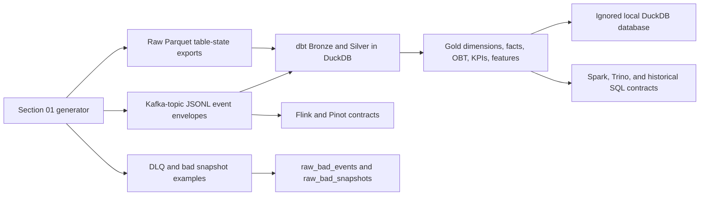

# Vina Bim Shop Coursework

`vina-bim-shop` is a local, reproducible data engineering coursework project for a Shopee-inspired Vietnamese marketplace. Sections 01 and 02 are fulfilled for the mini-coursework phase: Section 01 generates realistic offline and streaming source data, and Section 02 builds a runnable medallion schema using dbt-DuckDB.

Spark, Flink, Apache Pinot, and Trino are architectural target contracts in this phase. dbt-DuckDB is the runnable local implementation used to prove the schema, transformations, tests, and evidence without standing up the full distributed stack.

## End-To-End Flow



## Runnable Vs Contract

| Area | Status | Notes |
| --- | --- | --- |
| Section 01 source generation | Runnable locally | `uv run python scripts/generate/run_generator.py --scale medium --mode full --clean --seed 42` writes ignored raw files and committed evidence. |
| Section 02 dbt transformations | Runnable locally | `uv run dbt build --project-dir dbt --profiles-dir dbt` rebuilds `data/gold/vina_bim_shop.duckdb`. |
| Section 02 evidence generation | Runnable locally | `uv run python scripts/qa/generate_section02_evidence.py` writes committed summary reports and screenshots. |
| Final dataset packaging | Runnable locally | `uv run python scripts/qa/finalize_sections_01_02.py` regenerates medium evidence, packages raw data, and runs tests. |
| Spark batch path | Architectural contract | Spark represents the target batch processing path; local execution is dbt-DuckDB. |
| Flink realtime path | Architectural contract | Flink represents target event-time metrics and alerts; no local Flink job is required for Sections 01/02. |
| Apache Pinot serving | Architectural contract | Pinot table names are documented serving contracts only; no Pinot JSON configs are added in this phase. |
| Trino historical SQL | Architectural contract | Trino is the target SQL serving layer over Gold; DuckDB is the local SQL harness. |

## One-Command Happy Path

```powershell
uv run python scripts/qa/finalize_sections_01_02.py
```

This command:

1. regenerates the final `medium` Section 01 raw dataset with seed `42`;
2. rebuilds Section 02 dbt evidence from the generated raw inputs;
3. writes `evidence/final_dataset/vina_bim_shop_medium_raw.zip`;
4. writes `evidence/final_dataset/final_dataset_manifest.json`;
5. runs `uv run pytest`.

For a manual run:

```powershell
uv sync
uv run python scripts/generate/run_generator.py --scale medium --mode full --clean --seed 42
uv run dbt build --project-dir dbt --profiles-dir dbt
uv run python scripts/qa/generate_section02_evidence.py
uv run pytest
```

`data/gold/vina_bim_shop.duckdb` is ignored by Git. Reproduce it with:

```powershell
uv run dbt build --project-dir dbt --profiles-dir dbt
```

## Completion Checklist

| Requirement | Status | Evidence |
| --- | --- | --- |
| Section 01 offline datasets | Fulfilled | `deliverables/01_data_generator.md`, `evidence/01_data_generator/quality_report.md` |
| Section 01 streaming datasets | Fulfilled | Kafka-topic JSONL under ignored `data/raw/kafka_topics/`, summarized in Section 01 evidence |
| Section 01 quarantine/DLQ examples | Fulfilled | `dead_letter_events` and `bad_snapshots` are generated and modeled in dbt Bronze |
| Section 02 Bronze/Silver/Gold schema | Fulfilled | `deliverables/02_schema_design.md`, `evidence/02_schema_design/dbt_build_report.md` |
| Section 02 dbt tests | Fulfilled | dbt evidence records model/test results |
| Final raw dataset archive | Fulfilled after finalizer run | `evidence/final_dataset/vina_bim_shop_medium_raw.zip` |
| Final dataset manifest | Fulfilled after finalizer run | `evidence/final_dataset/final_dataset_manifest.json` |

## Evidence Map

| Artifact | Purpose |
| --- | --- |
| `deliverables/01_data_generator.md` | Section 01 design, run instructions, generated data contracts, evidence summary. |
| `deliverables/02_schema_design.md` | Section 02 schema rationale, dbt-DuckDB model design, business formulas, evidence summary. |
| `evidence/01_data_generator/quality_report.md` | Section 01 row counts, quality metrics, Kafka topic counts, issue manifest summary. |
| `evidence/02_schema_design/dbt_build_report.md` | Section 02 dbt model/test summary and Gold row counts. |
| `evidence/02_schema_design/run_manifest.json` | Section 02 evidence command metadata, model/test counts, screenshot render mode. |
| `evidence/final_dataset/final_dataset_manifest.json` | Final medium raw archive metadata, checksums, row counts, and reproduction paths. |

## Known Limits For This Phase

- Observability/security/CI/CD are intentionally out of scope for this Section 01/02 finalization.
- Section 03 drift/change scenarios and AI tracks are intentionally out of scope for this finalization.
- Spark, Flink, Apache Pinot, and Trino are architectural target contracts, not runnable local services here.
- The committed final archive contains raw generated inputs only. DuckDB and dbt target outputs are regenerated locally and remain ignored.
