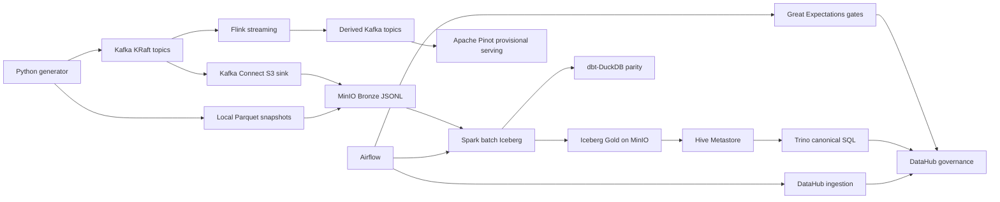

# Vina Bim Shop Coursework

`vina-bim-shop` is a staged, runnable local data engineering platform for a Shopee-inspired Vietnamese marketplace. All services — Kafka, Spark, Flink, Apache Pinot, Trino, Airflow, Great Expectations, and DataHub — are runnable via Docker Compose profiles. dbt-DuckDB is retained as a fast local compatibility and parity-testing path.

## Mini-Coursework Status

Sections 01 and 02 are fulfilled for the mini-coursework phase.

For the original Sections 01/02 submission boundary, Spark, Flink, Apache Pinot, and Trino are architectural target contracts, while dbt-DuckDB is the runnable local implementation. The broader repository now also includes the later runnable ADR 01-08 platform implementation.

| View | Meaning |
|------|---------|
| `Runnable locally` | `dbt-DuckDB`, the final dataset package, and the documented evidence artifacts can be reproduced on one machine. |
| `Architectural contract` | The staged Kafka, Spark, Flink, Pinot, Trino, Airflow, and DataHub stack documents the full target platform and is implemented in the later ADRs. |

Mini-coursework artifacts and evidence:

- `uv run python scripts/qa/finalize_sections_01_02.py`
- `evidence/final_dataset/vina_bim_shop_medium_raw.zip`
- `evidence/final_dataset/final_dataset_manifest.json`
- `data/gold/vina_bim_shop.duckdb`
- `deliverables/01_data_generator.md`
- `deliverables/02_schema_design.md`
- `architecture/diagrams/physical_gold_model.puml`
- `architecture/diagrams/physical_gold_model.png`
- `evidence/01_data_generator/quality_report.md`
- `evidence/02_schema_design/dbt_build_report.md`

## Quickstart: Staged Profiles

Start each profile in order. All services share one Docker network.

| Profile | Services | Command |
|---------|----------|---------|
| `ingestion` | Kafka KRaft, Schema Registry, Kafka Connect, Kafka UI | `docker compose --profile ingestion up -d` |
| `lakehouse` | MinIO, Hive Metastore, Trino, shared Postgres | `docker compose --profile lakehouse up -d` |
| `batch` | Spark master, worker, history server | `docker compose --profile batch up -d` |
| `streaming` | Flink JobManager, TaskManager, job submitter | `docker compose --profile streaming up -d` |
| `serving` | Apache Pinot (Zookeeper, controller, broker, server) | `docker compose --profile serving up -d` |
| `orchestration` | Airflow webserver, scheduler, GX Data Docs | `docker compose --profile orchestration up -d` |
| `governance` | DataHub GMS, frontend, actions, OpenSearch | `docker compose --profile governance up -d` |
| `all` | Everything above | `docker compose --profile all up -d` |

`all` is best-effort and high-resource. Staged profiles are the normal workflow. An end-to-end platform run needs: `ingestion` → `lakehouse` → `batch` → `streaming` → `serving` → `orchestration` → `governance`.

## End-To-End Flow



## One-Command Happy Path

### Full distributed stack (staged startup)

```powershell
docker compose --profile ingestion up -d
docker compose --profile lakehouse up -d
docker compose --profile batch up -d
docker compose --profile streaming up -d
docker compose --profile serving up -d
docker compose --profile orchestration up -d
docker compose --profile governance up -d
```

Then generate data and run the pipeline:

```powershell
uv run python scripts/generate/run_generator.py --scale medium --mode full --clean --seed 42
# Bootstrap Kafka topics -> Kafka Connect S3 sink -> Spark batch -> Trino query -> Flink -> Pinot
```

### dbt-DuckDB local compatibility path

For fast iteration without Docker:

```powershell
uv sync
uv run python scripts/generate/run_generator.py --scale medium --mode full --clean --seed 42
uv run dbt build --project-dir dbt --profiles-dir dbt
uv run pytest
```

All Gold row counts and KPI values match between dbt-DuckDB and Spark/Iceberg/Trino. See `evidence/05_spark_batch/dbt_parity_report.md`.

### Final evidence packaging

```powershell
uv run python scripts/qa/finalize_sections_01_02.py
```

### Script entrypoints

Use the stage-specific script folders below as the canonical execution surface:

| Folder | Purpose |
|--------|---------|
| `scripts/generate/` | Section 01 synthetic source generation |
| `scripts/kafka/` | Kafka bootstrap, schemas, smoke tests, and ingestion evidence |
| `scripts/lakehouse/` | Bronze landing, Trino smoke queries, and lakehouse evidence |
| `scripts/spark/` | Spark batch submission and Spark evidence capture |
| `scripts/flink/` | Flink job entrypoints, smoke publishing, and streaming evidence |
| `scripts/pinot/` | Pinot bootstrap, query examples, and serving evidence |
| `scripts/datahub/` | DataHub governance evidence capture |
| `scripts/qa/` | Reset, final packaging, and grading-oriented evidence helpers |

`data/raw/` and `data/gold/` are intentionally kept as local output directories. Their generated contents stay ignored, while the folder intent is preserved by nested `.gitignore` files.

## Reset / Fresh Start

```powershell
# Preview what would be destroyed (safe, read-only)
uv run python scripts/qa/reset_all.py --dry-run

# Full reset with confirmation prompt
uv run python scripts/qa/reset_all.py

# Full reset without prompt (scripts/CI)
uv run python scripts/qa/reset_all.py --force

# Selective reset (just Kafka)
uv run python scripts/qa/reset_all.py --profile ingestion

# Reset including local git-ignored data
uv run python scripts/qa/reset_all.py --clean-local-data
```

The reset script stops services, removes Docker volumes, and optionally cleans git-ignored local data (`data/raw/`, `dbt/target/`, `evidence/runtime/`). It never touches committed code or evidence.

## Runnable Vs Contract

| Area | Status | Notes |
|------|--------|-------|
| Section 01 source generation | Runnable | `uv run python scripts/generate/run_generator.py --scale medium --mode full --clean --seed 42` |
| Section 02 dbt transformations | Runnable | `uv run dbt build --project-dir dbt --profiles-dir dbt` |
| Kafka ingestion | Runnable | Profile `ingestion`. Topics, schemas, Connect S3 sink. |
| MinIO lakehouse + Trino | Runnable | Profile `lakehouse`. Iceberg tables, Hive Metastore, SQL serving. |
| Spark batch (Iceberg Gold) | Runnable | Profile `batch`. dbt logic rewritten as Spark/Iceberg jobs. |
| Flink streaming | Runnable | Profile `streaming`. Event-time metrics, derived Kafka topics. |
| Apache Pinot serving | Runnable | Profile `serving`. Realtime OLAP on derived topics. |
| Airflow + GX orchestration | Runnable | Profile `orchestration`. DAGs, validation gates, Data Docs. |
| DataHub governance | Runnable | Profile `governance`. Metadata, lineage, tags, glossary. |
| dbt-DuckDB parity | Runnable | Local compatibility path; matches Spark Gold on all row counts. |

## Evidence Map

| Artifact | Purpose |
|----------|---------|
| `deliverables/01_data_generator.md` | Section 01 design, run instructions, generated data contracts. |
| `deliverables/02_schema_design.md` | Section 02 schema rationale, dbt-DuckDB model design, business formulas. |
| `architecture/diagrams/lambda_architecture.puml` | Runnable Lambda architecture with all services. |
| `architecture/diagrams/schema_design.puml` | Schema design mapped to runnable profiles. |
| `architecture/diagrams/physical_gold_model.puml` | Physical data model (dbt-DuckDB and Spark/Iceberg/Trino). |
| `evidence/03_kafka_ingestion/` | Kafka topics, schemas, Connect evidence. |
| `evidence/04_lakehouse/` | MinIO, Hive Metastore, Trino evidence. |
| `evidence/05_spark_batch/` | Spark batch, Iceberg Gold, dbt parity report. |
| `evidence/06_flink_streaming/` | Flink jobs, checkpoint state, derived topics. |
| `evidence/07_pinot_serving/` | Pinot tables, dashboard results, reconciliation. |
| `evidence/08_airflow_gx/` | Airflow DAGs, GX validation results. |
| `evidence/09_datahub_governance/` | DataHub lineage, tags, glossary evidence. |
| `evidence/final_integration/` | Final integration evidence: health JSON, manifests, screenshots. |

## Known Limits

- The full `all` profile runs ~20 containers. Staged profiles run under ~4 GB RAM.
- dbt-DuckDB is a local compatibility path; Spark/Iceberg/Trino is canonical for reconciled truth.
- Pinot is fresh and provisional; Trino-served Gold tables are the official KPI source.
- Airflow orchestrates batch and control-plane work; it does not supervise long-running Flink jobs in v1.
- DataHub requires separate ingestion recipe runs after platform services are healthy.
- Observability, security, CI/CD, and Section 03 drift scenarios are deferred.

## Architecture Decisions

All decisions live in `architecture/decisions/`. The roadmap:

| ADR | Session |
|-----|---------|
| `00-full-stack-platform-roadmap.md` | Full-stack platform index and invariants |
| `01-kafka-kraft-ingestion-plan.md` | Kafka KRaft, Schema Registry, Connect |
| `02-minio-hive-trino-lakehouse-plan.md` | MinIO, Hive Metastore, Trino lakehouse |
| `03-spark-batch-iceberg-plan.md` | Spark batch Iceberg Silver/Gold |
| `04-flink-streaming-plan.md` | Flink streaming, derived topics |
| `05-apache-pinot-serving-plan.md` | Pinot realtime OLAP serving |
| `06-airflow-gx-orchestration-plan.md` | Airflow DAGs, GX quality gates |
| `07-datahub-governance-plan.md` | DataHub metadata, lineage, governance |
| `08-final-integration-evidence-plan.md` | Final integration, evidence, diagrams, README |
