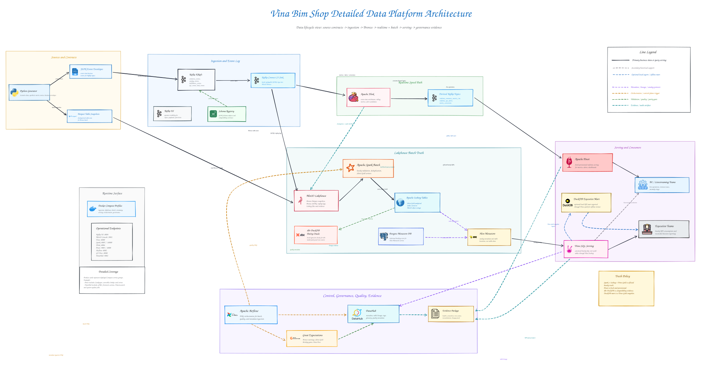

# Vina Bim Shop Data Platform Coursework

`vina-bim-shop` is a staged, runnable local data engineering platform for a Shopee-inspired Vietnamese marketplace. It demonstrates how a modern e-commerce platform can support both realtime operational analytics and batch-reconciled historical analytics through a Lambda-style architecture.

The platform is runnable locally, but it should be operated through staged Docker Compose profiles. A broad full-stack startup attempt can cause Docker instability and API inspection failures on constrained machines, so this evidence pass treats staged startup as the supported workflow rather than relying on a monolithic `all` startup.

---

## Table of Contents

- [System Architecture](#system-architecture)
- [Tech Stack](#tech-stack)
- [Introduction](#introduction)
- [Problem Definition](#problem-definition)
- [Coursework Status](#coursework-status)
- [Platform Implementation Overview](#platform-implementation-overview)
- [Repository Structure](#repository-structure)
- [Prerequisites](#prerequisites)
- [Installation & Setup](#installation--setup)
- [Configuration](#configuration)
- [Known Limits](#known-limits)
- [Data](#data)

---

## System Architecture



The detailed architecture view shows the project as a staged local platform: synthetic source contracts feed Kafka and local batch snapshots, Spark and Flink process the two analytical paths, Trino and Pinot expose different serving surfaces, and Airflow, Great Expectations, DataHub, and evidence artifacts make the run auditable.

Related diagrams:

- [Detailed PlantUML architecture](architecture/diagrams/detailed-lambda_architecture.puml)
- [Runnable Lambda architecture](architecture/diagrams/lambda_architecture.puml)
- [Schema design overview](architecture/diagrams/schema_design.puml)
- [Physical Bronze/Silver/Gold model](architecture/diagrams/physical_gold_model.puml)
- [Gold layer ERD DBML](architecture/diagrams/gold_layer_ERD.dbml)

---

## Tech Stack

| Layer | Technology | Purpose |
| --- | --- | --- |
| Source generation | Python, Faker, pandas, PyArrow | Generate Vietnamese marketplace snapshots, event streams, and evidence. |
| Ingestion | Kafka KRaft, Schema Registry, Kafka Connect, Kafka UI | Run event-log ingestion, JSON Schema registration, Bronze landing, and topic inspection. |
| Lakehouse storage | MinIO, Hive Metastore, Postgres, Apache Iceberg | Store Bronze replay logs, Silver/Gold tables, checkpoints, and catalog metadata. |
| Batch processing | Apache Spark, dbt-DuckDB | Build reconciled Silver/Gold tables and maintain a local parity oracle. |
| Streaming processing | Apache Flink | Produce event-time realtime metrics, alerts, and derived Kafka topics. |
| Serving | Trino, Apache Pinot, DuckDB | Serve canonical Gold SQL, provisional realtime OLAP, and portable local analysis marts. |
| Orchestration and quality | Apache Airflow, Great Expectations | Trigger control-plane workflows and publish validation evidence. |
| Governance | DataHub, OpenSearch | Emit metadata, tags, glossary terms, quality assertions, and lineage evidence. |
| Runtime | Docker Compose profiles, `uv`, pytest | Run the local stack, Python tooling, and verification suite. |

---

## Introduction

`vina-bim-shop` models the data platform needs of a Vietnamese e-commerce marketplace with customers, sellers, products, promotions, orders, payments, shipments, inventory, and user behavior events. The project is coursework-oriented, but it is intentionally built around realistic data engineering concerns: source contracts, replayable event logs, medallion lakehouse storage, quality gates, serving-layer truth policies, and evidence packaging.

The main design choice is a Lambda architecture because the platform needs two complementary analysis streams:

- **Realtime analysis** for low-latency operational views such as traffic bursts, payment issues, live conversion, and alert candidates.
- **Batch analysis** for reconciled executive KPIs, dimensional modeling, financial formulas, and repeatable historical reporting.

Kafka, Flink, and Pinot provide the fresh but provisional speed path. MinIO, Spark, Iceberg, Hive Metastore, Trino, and DuckDB provide the reconciled batch path. Airflow, Great Expectations, and DataHub make the platform inspectable for coursework evidence.

---

## Problem Definition

The platform answers a practical e-commerce data problem: how can a marketplace support live operational monitoring while still preserving a reliable historical source of truth for business reporting?

The source design deliberately includes both event envelopes and table-state exports:

| Source stream | Answers | Used by |
| --- | --- | --- |
| Kafka-shaped JSON event envelopes | What happened now? | Flink realtime metrics, Pinot dashboards, replay logs, behavior analysis. |
| Periodic table-state snapshots | What state is reliable at checkpoint? | Spark batch reconciliation, Gold dimensions/facts, Trino SQL, DuckDB evidence. |

The overlap is intentional. Orders, payments, shipments, and customer behavior can appear in both streams because events provide immediacy while snapshots provide checkpointed source-of-record state.

The generator also injects intentional data errors and contract drift so the platform can demonstrate realistic handling instead of only happy-path data:

- duplicate order-item payloads and duplicate commerce-event envelopes
- late-arriving commerce events
- missing values in fields such as `shipping_method`, `brand`, and `device_type`
- schema evolution where older slices miss newer optional fields
- malformed event and snapshot examples routed through `dead_letter_events`, `raw_bad_events`, and `raw_bad_snapshots`
- traffic burst and schema-version signals in operational events

---

## Coursework Status

Sections 01 and 02 are fulfilled for the mini-coursework phase.

For the original Sections 01/02 submission boundary, Spark, Flink, Apache Pinot, and Trino are architectural target contracts, while dbt-DuckDB is the runnable local implementation. The broader repository now also includes the staged runnable platform implementation for ingestion, lakehouse, batch, streaming, serving, orchestration, and governance.

| View | Meaning |
| --- | --- |
| `Runnable locally` | `dbt-DuckDB`, the final dataset package, and the documented evidence artifacts can be reproduced on one machine. |
| `Architectural contract` | The staged Kafka, Spark, Flink, Pinot, Trino, Airflow, and DataHub stack documents the full target platform through service-level deliverables and evidence. |

Mini-coursework artifacts and evidence:

- `uv run python scripts/qa/finalize_sections_01_02.py`
- [Final raw dataset zip](evidence/final_dataset/vina_bim_shop_medium_raw.zip)
- [Final dataset manifest](evidence/final_dataset/final_dataset_manifest.json)
- `data/gold/vina_bim_shop.duckdb`
- `data/gold/vina_bim_shop_executive.duckdb`
- [Data generator deliverable](deliverables/01_data_generator.md)
- [Schema design deliverable and Data Dictionary](deliverables/02_schema_design.md)
- [Physical Gold model PlantUML](architecture/diagrams/physical_gold_model.puml)
- [Physical Gold model PNG](architecture/diagrams/physical_gold_model.png)
- [Generator quality report](evidence/01_data_generator/quality_report.md)
- [dbt build report](evidence/02_schema_design/dbt_build_report.md)

---

## Platform Implementation Overview

The root README is the entrypoint. The deeper service-by-service explanations live in [deliverables](deliverables/) and evidence folders, so the descriptions below are intentionally concise.

| Stage | Profile or local path | Services and assets | Deep dive |
| --- | --- | --- | --- |
| Data generation | local Python | Synthetic snapshots, Kafka-shaped JSONL, bad records, quality evidence. | [01 data generator](deliverables/01_data_generator.md) |
| Ingestion | `ingestion` | Kafka KRaft, Schema Registry, Kafka Connect, Kafka UI. | [03 Kafka ingestion](deliverables/03_kafka_ingestion.md) |
| Lakehouse | `lakehouse` | MinIO, Hive Metastore, Trino, shared Postgres. | [04 lakehouse](deliverables/04_lakehouse.md) |
| Batch | `batch` plus dbt-DuckDB | Spark master, worker, history server, Iceberg Gold, dbt parity. | [05 Spark batch](deliverables/05_spark_batch.md) |
| Local analytics | local DuckDB files plus dbt | dbt-DuckDB parity oracle and DuckDB Executive Mart export. | [10 DuckDB/dbt local analytics](deliverables/10_duckdb_dbt_local_analytics.md) |
| Streaming | `streaming` | Flink JobManager, TaskManager, job submitter, derived Kafka topics. | [06 Flink streaming](deliverables/06_flink_streaming.md) |
| Serving | `serving` plus Trino/DuckDB | Apache Pinot realtime OLAP, Trino canonical SQL, DuckDB local marts. | [07 Pinot serving](deliverables/07_pinot_serving.md) |
| Orchestration | `orchestration` | Airflow webserver, scheduler, init, GX Data Docs. | [08 Airflow + GX](deliverables/08_airflow_gx_orchestration.md) |
| Governance | `governance` | DataHub GMS, frontend, actions, OpenSearch, metadata recipes. | [09 DataHub governance](deliverables/09_datahub_governance.md), [DataHub evidence](evidence/final_integration/datahub_lineage.md) |

### Data Generation

The generator creates offline Parquet snapshots and Kafka-topic-shaped JSONL files under `data/raw/`, plus committed evidence under `evidence/01_data_generator/`. It produces source entities such as customers, sellers, products, promotions, orders, payments, shipments, inventory snapshots, commerce events, catalog events, fulfillment events, ops events, and quarantine examples.

Key docs:

- [Generator deliverable](deliverables/01_data_generator.md)
- [Source event catalog](architecture/domain/source-event-catalog.md)
- [Source-to-target mapping](architecture/domain/source-to-target-mapping.md)

### Ingestion

The ingestion profile turns the generated event contracts into a real Kafka surface. Topics are bootstrapped from `infra/kafka/topics.yaml`, JSON Schemas are registered from `infra/kafka/schemas/`, and Kafka Connect lands replayable source-topic events into MinIO Bronze.

Key docs:

- [Kafka ingestion deliverable](deliverables/03_kafka_ingestion.md)
- [Kafka ingestion evidence](evidence/03_kafka_ingestion/)

### Lakehouse

The lakehouse profile provides MinIO object storage, a Hive Metastore backed by Postgres, and Trino SQL access. Bronze contains source-fidelity snapshots and event logs; Spark writes curated Iceberg Silver and Gold tables into the same object-store ecosystem.

| Note | Implementation | Why it matters |
| --- | --- | --- |
| Local reproducibility | `data/gold/vina_bim_shop.duckdb` can be rebuilt locally without relying on all runtime services. | A single local DuckDB file is easy to inspect in DBeaver and package as evidence. |

Key docs:

- [Lakehouse deliverable](deliverables/04_lakehouse.md)
- [Lakehouse evidence](evidence/04_lakehouse/)

### Batch

Spark is the distributed batch implementation for Bronze-to-Silver-to-Gold processing over MinIO/Iceberg. dbt-DuckDB remains the local compatibility and parity-testing path. All Gold row counts and KPI values match between dbt-DuckDB and Spark/Iceberg/Trino in the audited evidence.

Serving truth policy:

| Surface | Best for | Truth role | Storage |
| --- | --- | --- | --- |
| Trino SQL Serving | Shared SQL over current Iceberg Gold tables | Canonical online query surface | Service-backed; reads MinIO/Iceberg through Hive. |
| DuckDB Executive Mart | Fast local slicing, offline demos, spreadsheet-style investigation | Portable copy of canonical Gold; stale until regenerated. | `data/gold/vina_bim_shop_executive.duckdb` |
| dbt-DuckDB Parity Oracle | Data engineering regression checks | Independent local rebuild used to compare row counts and KPIs. | `data/gold/vina_bim_shop.duckdb` |

The DuckDB Executive Mart is a Trino Gold snapshot export, not a second transformation layer.

Key docs:

- [Spark batch deliverable](deliverables/05_spark_batch.md)
- [Spark batch evidence](evidence/05_spark_batch/)
- [dbt parity report](evidence/05_spark_batch/dbt_parity_report.md)
- [DuckDB/dbt local analytics deliverable](deliverables/10_duckdb_dbt_local_analytics.md)

### Streaming

Flink consumes Kafka source topics, applies event-time logic, and emits derived topics for realtime serving. The streaming path is intentionally fresh and provisional; it supports operations and live dashboarding, not final financial reporting.

Derived topic contracts:

- `realtime_commerce_metrics_1m`
- `realtime_ops_alerts`
- `realtime_metric_corrections`

Key docs:

- [Flink streaming deliverable](deliverables/06_flink_streaming.md)
- [Flink evidence](evidence/06_flink_streaming/)

### Serving

Serving is split by freshness and truth role. Trino serves canonical SQL over Spark-written Gold tables. Pinot serves low-latency realtime OLAP over Flink-derived topics. DuckDB provides portable local files for parity checks and executive review.

Schema design is part of the serving implementation, not just documentation. The committed model artifacts are:

- [Physical Bronze/Silver/Gold model](architecture/diagrams/physical_gold_model.puml)
- [Rendered physical Gold model](architecture/diagrams/physical_gold_model.png)
- [Gold layer ERD DBML](architecture/diagrams/gold_layer_ERD.dbml)
- [Schema design deliverable and Data Dictionary](deliverables/02_schema_design.md)

Key docs:

- [Pinot serving deliverable](deliverables/07_pinot_serving.md)
- [Pinot evidence](evidence/07_pinot_serving/)

### Orchestration

Airflow owns the control-plane workflow for local evidence runs: topic bootstrap, hourly batch lakehouse processing, Pinot bootstrap, reconciliation reporting, local evidence generation, and DataHub ingestion. Great Expectations publishes validation reports through the GX Data Docs static server.

Key docs:

- [Airflow + GX deliverable](deliverables/08_airflow_gx_orchestration.md)
- [Airflow + GX evidence](evidence/08_airflow_gx/)

### Governance

DataHub is used as the local governance layer after meaningful platform assets exist. The evidence records metadata emission for Kafka, MinIO/S3 prefixes, Trino/Iceberg, dbt, Spark lineage, Flink lineage, GX assertions, tags, and representative dataset verification.

Known limitation: local DataHub frontend did not render the fuller graph view during capture, even though the repo evidence supports that metadata emission occurred. The authoritative proof is paired from GMS health, GraphQL/entity verification, dataset counts, tag counts, and the final DataHub evidence summary.

Key docs:

- [DataHub governance deliverable](deliverables/09_datahub_governance.md)
- [DataHub evidence summary](evidence/final_integration/datahub_lineage.md)
- [Governance evidence folder](evidence/09_datahub_governance/)

---

## Repository Structure

```text
coursework/
|-- airflow/                  # Airflow DAGs for bootstrap, batch, quality, serving, and governance runs
|-- architecture/             # Domain contracts, PlantUML, DBML, and Excalidraw architecture assets
|-- configs/                  # Generator, scenario, and pipeline configuration
|-- data/                     # Gitignored local raw and Gold outputs, with folder-intent .gitignore files
|-- dbt/                      # dbt-DuckDB Bronze, Silver, Gold models, tests, macros, and profile
|-- deliverables/             # Official coursework writeups and service-level documentation
|-- evidence/                 # Committed evidence packages, screenshots, manifests, reports, and query outputs
|-- infra/                    # Docker images and service config for Kafka, lakehouse, Spark, Flink, Pinot, governance
|-- scripts/                  # CLI entrypoints for generation, bootstrap, smoke tests, evidence, reset, and exports
|-- src/vina_bim_shop/        # Python packages for generation, Kafka, lakehouse, Flink, Pinot, quality, and governance
|-- tests/                    # Unit and integration checks for contracts, runtime helpers, evidence, and docs
|-- docker-compose.yml        # Staged local platform profiles
|-- pyproject.toml            # Python project metadata and dependencies
`-- uv.lock                   # Locked Python dependency graph
```

---

## Prerequisites

| Tool | Recommended version | Purpose |
| --- | --- | --- |
| Docker Desktop / Docker Compose | Docker 24+ | Run staged service profiles. |
| Python | 3.12+ | Run generator, scripts, tests, dbt-DuckDB path. |
| `uv` | Current stable | Install and run the Python environment. |
| Git | Current stable | Clone and inspect the coursework repo. |
| DBeaver or DuckDB CLI | Optional | Inspect local DuckDB evidence files. |
| PlantUML / DBML tooling | Optional | Preview architecture and ERD files locally. |

The repo includes `.env.example` with local defaults. Copy it to `.env` if you want explicit environment settings.

---

## Installation & Setup

This project is designed to demonstrate the platform end to end through staged local execution, with each subsystem being verifiable. It is not reliably optimized for a single frictionless full-stack-at-once startup on a constrained machine.

### 1. Install Python dependencies

```powershell
uv sync
```

### 2. Run the fast local compatibility path

Use this path when you want reproducible Section 01/02 evidence without starting the distributed services.

```powershell
uv run python scripts/generate/run_generator.py --scale medium --mode full --clean --seed 42
uv run dbt build --project-dir dbt --profiles-dir dbt
uv run pytest
```

### 3. Start the distributed platform in stages

Start each profile in order. All services share the same Docker network.

```powershell
docker compose --profile ingestion up -d
docker compose --profile lakehouse up -d
docker compose --profile batch up -d
docker compose --profile streaming up -d
docker compose --profile serving up -d
docker compose --profile orchestration up -d
docker compose --profile governance up -d
```

The `all` profile exists for best-effort demos, but staged startup is the supported evidence workflow.

### 4. Generate final Section 01/02 package evidence

```powershell
uv run python scripts/qa/finalize_sections_01_02.py
```

### 5. Export the local executive mart

Run this after Spark Gold tables are available through Trino.

```powershell
uv run python scripts/spark/export_executive_mart.py --duckdb-path data/gold/vina_bim_shop_executive.duckdb --evidence-root evidence/05_spark_batch
```

### 6. Reset local runtime state

```powershell
# Preview what would be destroyed
uv run python scripts/qa/reset_all.py --dry-run

# Full reset with confirmation prompt
uv run python scripts/qa/reset_all.py

# Full reset without prompt
uv run python scripts/qa/reset_all.py --force

# Reset including gitignored local generated data
uv run python scripts/qa/reset_all.py --clean-local-data
```

The reset script stops services, removes Docker volumes, and optionally cleans gitignored local data such as `data/raw/`, `dbt/target/`, and `evidence/runtime/`. It does not remove committed source files or committed evidence.

---

## Configuration

Local defaults are documented in [.env.example](.env.example). Most scripts work with defaults, but the variables below define the main configuration groups.

| Group | Variables | Default intent |
| --- | --- | --- |
| Runtime | `VBS_ENV`, `VBS_RANDOM_SEED`, `VBS_TAXONOMY_PATH` | Local execution with deterministic seed `42` and committed taxonomy snapshot. |
| Kafka | `VBS_KAFKA_BOOTSTRAP_SERVERS`, `VBS_SCHEMA_REGISTRY_URL`, `VBS_KAFKA_CONNECT_URL`, `VBS_KAFKA_UI_URL` | Local Kafka services on ports `9092`, `8081`, `8083`, and `8084`. |
| MinIO | `VBS_MINIO_ENDPOINT`, `VBS_MINIO_INTERNAL_ENDPOINT`, `VBS_MINIO_ROOT_USER`, `VBS_MINIO_ROOT_PASSWORD`, `VBS_MINIO_REGION` | Local object storage with internal Docker and external localhost endpoints. |
| Lakehouse catalog | `VBS_LAKEHOUSE_POSTGRES_*`, `VBS_HIVE_METASTORE_*`, `VBS_TRINO_*` | Shared Postgres, Hive Metastore, and Trino local serving defaults. |
| Spark | `VBS_SPARK_MASTER_URL`, `VBS_SPARK_MASTER_UI_URL`, `VBS_SPARK_HISTORY_URL` | Spark master, UI, and history server endpoints. |
| Flink | `VBS_FLINK_UI_URL`, `VBS_FLINK_JOBMANAGER_URL`, `VBS_FLINK_MAX_RUNTIME_MINUTES`, `VBS_FLINK_DISABLE_AUTO_STOP` | Flink UI/runtime settings and local safety timeout. |
| Pinot | `VBS_PINOT_CONTROLLER_URL`, `VBS_PINOT_BROKER_URL` | Pinot controller and broker endpoints for bootstrap and query scripts. |
| Orchestration | `VBS_AIRFLOW_UI_URL`, `VBS_AIRFLOW_ADMIN_USERNAME`, `VBS_AIRFLOW_ADMIN_PASSWORD`, `VBS_GX_DOCS_URL` | Airflow and GX Data Docs local URLs. |
| Data roots | `VBS_RAW_ROOT`, `VBS_BRONZE_*`, `VBS_*_BUCKET`, `VBS_DUCKDB_PATH` | Local raw output paths, MinIO bucket names, and DuckDB defaults. |

---

## Known Limits

- The platform is runnable locally, but only if you follow staged profile startup and accept some UI/runtime constraints.
- A broad full-stack startup attempt is known to cause Docker instability and API inspection failures on constrained machines; staged profiles are the normal workflow for this evidence pass.
- The full `all` profile is high-resource and best-effort, not the primary acceptance path.
- dbt-DuckDB is a local compatibility path; Spark/Iceberg/Trino is canonical for reconciled truth in the full platform evidence.
- The DuckDB Executive Mart is a local snapshot exported from Trino Gold; regenerate it after each Spark Gold refresh.
- Pinot is fresh and provisional; Trino-served Gold tables are the official KPI source.
- Airflow orchestrates batch and control-plane work; it does not supervise long-running Flink jobs in v1.
- DataHub requires separate ingestion recipe runs after platform services are healthy.
- Local DataHub UI capture did not render the fuller graph view, even though GMS/GraphQL evidence supports metadata, lineage, tag, and assertion emission.
- Observability hardening, production security, CI/CD, and Section 03 drift scenarios are outside the current evidence boundary.

---

## Data

Generated local data lives in `data/` and is intentionally gitignored except for nested `.gitignore` files that preserve folder intent.

| Path | Role | Git behavior |
| --- | --- | --- |
| `data/raw/` | Generator-managed raw Parquet snapshots, Kafka-topic JSONL files, and bad-record examples. | Gitignored local output. |
| `data/gold/vina_bim_shop.duckdb` | dbt-DuckDB parity oracle rebuilt from local raw inputs. | Gitignored local output. |
| `data/gold/vina_bim_shop_executive.duckdb` | DuckDB Executive Mart exported from Trino Gold. | Gitignored local output. |
| `evidence/final_dataset/vina_bim_shop_medium_raw.zip` | Submitted medium raw dataset package. | Committed evidence. |
| `evidence/final_dataset/final_dataset_manifest.json` | Manifest for the final dataset package. | Committed evidence. |
| `evidence/final_integration/` | Health JSON, screenshots, row counts, query outputs, reconciliation, and lineage evidence. | Committed evidence. |

Runtime service profiles:

| Profile | Services |
| --- | --- |
| `ingestion` | Kafka KRaft, Schema Registry, Kafka Connect, Kafka UI |
| `lakehouse` | MinIO, Hive Metastore, Trino, shared Postgres |
| `batch` | Spark master, worker, history server |
| `streaming` | Flink JobManager, TaskManager, job submitter |
| `serving` | Pinot Zookeeper, controller, broker, server |
| `orchestration` | Airflow webserver, scheduler, init, GX Data Docs |
| `governance` | DataHub GMS, frontend, actions, OpenSearch |
| `all` | Best-effort startup of all profiles; staged startup remains the supported workflow |
