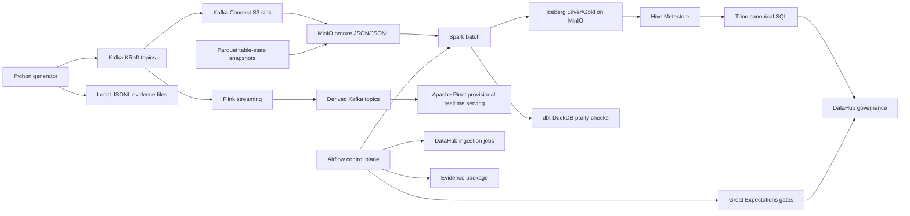

# ADR 00: Full-Stack Platform Roadmap

## Status

Planned.

## Date

2026-06-01

## Goal

Replace the previous "target contract only" implementation boundary with a staged, runnable local platform plan for the Vina Bim Shop coursework. The platform must prove the architecture with working services, repeatable smoke tests, UI evidence, and documentation that future Codex sessions can execute without re-deciding major design choices.

This file is the index and conflict-prevention guide for the eight follow-up implementation sessions.

## Scope

In scope:

- Bird's-eye runtime architecture for the full stack.
- Session order and dependency rules.
- Compose profile strategy and local resource policy.
- UI and evidence expectations.
- Cross-session invariants that prevent conflicting future implementation choices.

Out of scope:

- Implementing Docker services directly.
- Choosing exact image versions before each session smoke-validates them.
- Rewriting README or diagrams now; ADR 08 owns that final integration work.

## Architecture Invariants

| Area | Decision |
| --- | --- |
| Compose strategy | Use one root Docker Compose entrypoint with profiles. Do not require the entire stack for routine development. |
| Resource policy | Profile-level execution is the realistic local target under about 4 GB RAM. The full `all` profile is best-effort and may require more resources. |
| Existing dbt path | Keep `dbt-DuckDB` runnable as a compatibility path and regression oracle while Spark becomes the lakehouse implementation. |
| Bronze storage | Raw source snapshots remain Parquet; raw Kafka replay logs remain JSON/JSONL. |
| Silver/Gold storage | Use Apache Iceberg tables on MinIO through a Hive Metastore catalog. |
| Table write owner | Spark owns Silver/Gold writes. Trino reads, validates, and serves SQL. |
| Truth policy | Spark Gold queried through Trino is canonical. Pinot is fresh and provisional. |
| Stream serving | Flink writes derived Kafka topics; Pinot ingests from those derived topics. |
| Orchestration | Airflow orchestrates batch and control-plane work. It does not monitor long-running Flink jobs in v1. |
| Quality gates | Bronze warns and quarantines. Silver/Gold failures block DAGs. Pinot/DataHub checks warn unless reconciliation fails. |
| Governance timing | DataHub is implemented after Kafka, lakehouse, Spark, Flink, Pinot, and Airflow/GX assets exist. |
| Evidence | Every implementation session must produce evidence artifacts and screenshots for auditability. |
| Image versions | Each implementation session must pin image versions after smoke validation and record the version matrix in its evidence. |

## Session Order

| Session | ADR | Depends on | Main output |
| --- | --- | --- | --- |
| 1 | `2026-06-01-01-kafka-kraft-ingestion-plan.md` | Current generator contracts | Kafka KRaft, Schema Registry, Kafka UI, Kafka Connect, topics, producer smoke test. |
| 2 | `2026-06-01-02-minio-hive-trino-lakehouse-plan.md` | Session 1 only for shared network naming | MinIO buckets, Hive Metastore, Iceberg Hive catalog, Trino SQL. |
| 3 | `2026-06-01-03-spark-batch-iceberg-plan.md` | Session 2 | Spark batch rewrite of dbt logic into Iceberg Silver/Gold. |
| 4 | `2026-06-01-04-flink-streaming-plan.md` | Session 1 and Session 2 | Flink jobs consuming raw Kafka topics and writing derived Kafka topics plus MinIO checkpoints. |
| 5 | `2026-06-01-05-apache-pinot-serving-plan.md` | Session 1 and Session 4 | Pinot schemas, tables, ingestion jobs, queries, and UI evidence. |
| 6 | `2026-06-01-06-airflow-gx-orchestration-plan.md` | Sessions 1-5 | Airflow DAGs and Great Expectations validation gates. |
| 7 | `2026-06-01-07-datahub-governance-plan.md` | Sessions 1-6 | DataHub metadata ingestion, lineage, tags, glossary, and quality metadata. |
| 8 | `2026-06-01-08-final-integration-evidence-plan.md` | Sessions 1-7 | Final compose profiles, evidence, screenshots, diagrams, and README replacement. |

## Runtime Shape

## Compose Profiles

| Profile | Services | Purpose | Expected local use |
| --- | --- | --- | --- |
| `ingestion` | Kafka, Schema Registry, Kafka UI, Kafka Connect | Topic bootstrap and producer smoke tests. | Frequent. |
| `lakehouse` | MinIO, shared Postgres, Hive Metastore, Trino | Object storage, Iceberg catalog, canonical SQL. | Frequent. |
| `batch` | Spark master, Spark worker, Spark History Server | Batch lakehouse processing. | Frequent after lakehouse is ready. |
| `streaming` | Flink JobManager, Flink TaskManager | Long-running stream processing jobs. | Frequent during streaming work. |
| `serving` | Pinot controller, broker, server, minion as needed | Realtime OLAP serving. | Frequent during Pinot work. |
| `orchestration` | Airflow webserver, scheduler, init, GX static docs server | Control-plane DAGs and quality evidence. | Moderate. |
| `governance` | DataHub GMS/frontend/actions, OpenSearch | Metadata, lineage, tags, glossary. | Later sessions only. |
| `evidence` | Lightweight screenshot/static/report helpers if needed | Final evidence collection. | Final session. |
| `all` | All services | End-to-end demonstration. | Best-effort, high-resource. |

## UI And Port Matrix

Exact ports may be adjusted during implementation if conflicts are discovered, but every session must record the final port matrix.

| UI | Suggested local port | Profile | Evidence required |
| --- | ---: | --- | --- |
| Kafka UI | 8084 | `ingestion` | Topic list, message sample, Schema Registry subject view if supported. |
| Schema Registry API | 8081 | `ingestion` | Registered JSON Schema subjects. |
| Kafka Connect REST | 8083 | `ingestion` | Connector status JSON. |
| MinIO Console | 9001 | `lakehouse` | Buckets and representative objects. |
| Trino UI | 8080 | `lakehouse` | Query history and sample SQL result. |
| Spark Master UI | 8085 | `batch` | Running application. |
| Spark History Server | 18080 | `batch` | Completed job evidence. |
| Flink UI | 8086 | `streaming` | Running job and checkpoints. |
| Pinot UI | 9000 or implementation-safe alternative | `serving` | Table status and sample query. |
| Airflow UI | 8082 | `orchestration` | DAG graph and run state. |
| GX Data Docs | 8088 | `orchestration` | Validation report page from local artifacts. |
| DataHub UI | 9002 | `governance` | Search result, lineage graph, glossary/tags. |

## Implementation Rules For Future Sessions

- Keep each session narrow. Do not implement a later technology just because it is adjacent.
- Add one smoke command per session and one evidence location under `evidence/`.
- Prefer root compose profiles over independent compose islands.
- Preserve existing generated raw data rules: large local outputs remain ignored by Git.
- Update docs and diagrams only when they support the session's scope.
- Do not replace the dbt-DuckDB path until Spark parity has evidence.
- Do not let Pinot become the source of official KPI truth.
- Do not make Airflow responsible for supervising always-on Flink jobs in v1.
- Do not register raw Bronze event logs as normal analyst-facing tables.

## Do Not Do

- Do not turn this roadmap into a one-session implementation request.
- Do not make the `all` profile the only accepted local workflow.
- Do not allow later ADRs to change Spark table ownership, Pinot truth policy, or Airflow/Flink responsibility without an explicit new decision.
- Do not document local-only helper tools as required project dependencies.

## Smoke Tests And Acceptance Checks

The roadmap is accepted when:

- The eight numbered session ADRs exist.
- Each ADR repeats the relevant architecture invariants.
- No ADR conflicts on table ownership, truth policy, compose profiles, or orchestration boundaries.
- The old "contracts only" README narrative is explicitly marked for replacement in the final integration ADR.
- Commands shown in documentation are standard project commands and Docker commands only.

## Assumptions

- The current repository remains the planning source of truth for future Codex sessions.
- Profile-level execution is the practical local target, while full-stack execution is a best-effort demonstration.
- The existing dbt-DuckDB implementation remains useful until Spark parity evidence proves the new batch path.
