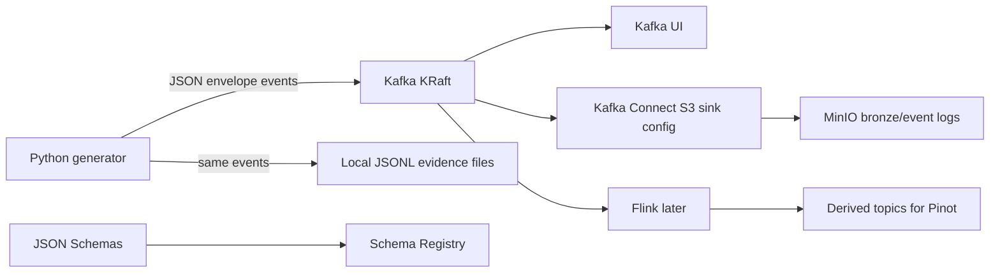

# ADR 01: Kafka KRaft Ingestion Plan

## Status

Planned.

## Date

2026-06-01

## Goal

Implement the runnable ingestion layer for Vina Bim Shop using single-broker Kafka in KRaft mode, Kafka UI, Schema Registry with JSON Schema, Kafka Connect, source-topic bootstrap, direct generator publishing, and producer/consumer smoke tests.

## Scope

In scope:

- Single-broker Kafka KRaft for local coursework.
- Kafka UI for inspection.
- Schema Registry for JSON Schema contracts.
- Kafka Connect for Bronze event landing to MinIO in a later integrated profile.
- Source topics and derived-topic placeholders.
- Generator support for direct Kafka publishing while preserving JSONL evidence files.
- Bootstrap and smoke-test scripts.

Out of scope:

- Multi-broker fault-tolerant Kafka.
- Production authentication, ACLs, and TLS.
- Avro conversion for v1 source events.
- Full Pinot ingestion, which belongs to ADR 05.

## Architecture Context

The existing generator already emits Kafka-shaped JSON envelopes. This session turns those contracts into real Kafka topics without removing the local evidence path.



Teaching note: Kafka is the durable event-ingestion interface. The local JSONL files are not a competing pipeline; they remain audit/debug artifacts and regression fixtures.

## Topic Contract

| Topic | Type | Producer | Consumer in later sessions | Notes |
| --- | --- | --- | --- | --- |
| `commerce_events` | Source | Generator | Flink, Kafka Connect, Spark replay through Bronze | Browsing, cart, checkout, order, payment events. |
| `catalog_events` | Source | Generator | Flink, Kafka Connect | Product, price, inventory, promotion changes. |
| `fulfillment_events` | Source | Generator | Flink, Kafka Connect | Shipment and fulfillment lifecycle events. |
| `ops_events` | Source | Generator | Flink, Kafka Connect | Heartbeat, burst, lateness, duplicates, schema evolution signals. |
| `dead_letter_events` | Source/quarantine | Generator or validators | Spark/GX inspection | Malformed or rejected records. |
| `realtime_commerce_metrics_1m` | Derived placeholder | Flink later | Pinot later | Created now so downstream plans share the name. |
| `realtime_ops_alerts` | Derived placeholder | Flink later | Pinot later | Created now so downstream plans share the name. |
| `realtime_metric_corrections` | Derived placeholder | Flink later | Pinot later | Full-snapshot late correction records. |

## Service And Profile Plan

| Service | Compose profile | UI/API | Health check |
| --- | --- | --- | --- |
| Kafka KRaft broker | `ingestion` | `localhost:9092` client API | `kafka-broker-api-versions` against internal listener. |
| Schema Registry | `ingestion` | `localhost:8081` API | `GET /subjects` succeeds. |
| Kafka UI | `ingestion` | Suggested `localhost:8084` | HTTP health endpoint or root page succeeds. |
| Kafka Connect | `ingestion` | `localhost:8083` REST | `GET /connectors` succeeds. |

Implementation should pin image versions after a successful smoke run. Avoid `latest` in committed compose files after the first validation pass.

## Schema Registry Decision

Use JSON Schema subjects for source topics. Keep the existing human-readable JSON envelope format.

Suggested subject names:

| Topic | Subject |
| --- | --- |
| `commerce_events` | `commerce_events-value` |
| `catalog_events` | `catalog_events-value` |
| `fulfillment_events` | `fulfillment_events-value` |
| `ops_events` | `ops_events-value` |
| `dead_letter_events` | `dead_letter_events-value` |

Minimum envelope fields enforced by JSON Schema:

```json
{
  "event_id": "string",
  "event_type": "string",
  "event_topic": "string",
  "schema_version": "integer",
  "event_timestamp": "string",
  "created_ts": "string",
  "producer": "string",
  "correlation_ids": "object",
  "payload": "object"
}
```

## Implementation Steps For Future Session

1. Add root compose profile services for Kafka, Schema Registry, Kafka UI, and Kafka Connect.
2. Add `.env.example` entries for local Kafka bootstrap servers and Schema Registry URL.
3. Add topic bootstrap script that creates all source and derived-placeholder topics idempotently.
4. Add JSON Schema files for each source topic and register them idempotently.
5. Extend the generator with a Kafka publishing mode that also writes existing JSONL evidence files.
6. Add a producer smoke test that publishes a small deterministic event set.
7. Add a consumer smoke test that reads back messages by topic and validates envelope shape.
8. Add Kafka Connect S3 sink configuration templates for Bronze JSON/JSONL landing, but do not require MinIO until ADR 02 is available.
9. Capture evidence under `evidence/03_kafka_ingestion/`.

## Smoke Tests And Acceptance Checks

| Check | Required evidence |
| --- | --- |
| Topic bootstrap | Topic list includes all source and derived-placeholder topics. |
| Schema registration | Schema Registry returns expected subjects. |
| Producer run | Generator publishes deterministic sample messages and writes matching JSONL files. |
| Consumer readback | Consumer reads at least one message per source topic. |
| Envelope validation | Message payloads satisfy JSON Schema and existing event contract tests. |
| Kafka UI | Screenshot of topics and sample messages. |
| Kafka Connect | REST status captured, even if MinIO sink is activated in the lakehouse session. |

## Do Not Do

- Do not replace JSON envelopes with Avro in v1.
- Do not remove local JSONL evidence outputs.
- Do not create a multi-broker local Kafka cluster.
- Do not make derived Flink metrics in this session; only create placeholder topics.
- Do not introduce production-grade security features before the local pipeline is working.

## Assumptions

- Source topics remain exactly as named in the existing architecture docs.
- Kafka data should be resettable by cleanup commands, not treated as durable coursework evidence.
- Kafka Connect is the preferred owner for Kafka-to-MinIO Bronze event landing once MinIO exists.

