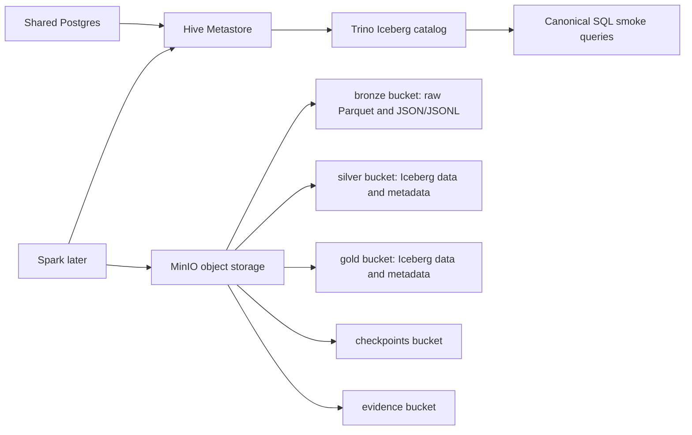

# ADR 02: MinIO, Hive Metastore, And Trino Lakehouse Plan

## Status

Planned.

## Date

2026-06-01

## Goal

Implement the local lakehouse substrate that Spark, Trino, Airflow, GX, and DataHub will use later: MinIO object storage, shared Postgres-backed Hive Metastore, Iceberg Hive catalog, and Trino SQL serving.

## Scope

In scope:

- MinIO buckets for medallion and operational storage.
- Shared Postgres service with isolated databases for metastore and later platform services.
- Hive Metastore backed by Postgres.
- Trino configured to query Iceberg tables through the Hive catalog.
- Fixed local development credentials in `.env.example`.
- Trino and MinIO smoke tests.

Out of scope:

- Spark transformation logic, which belongs to ADR 03.
- Registering Bronze raw files as analyst tables.
- DataHub ingestion, which belongs to ADR 07.
- Production S3 security policies.

## Architecture Context

This session should happen before Spark because Spark needs a real target for Iceberg Silver/Gold tables.

Teaching note: MinIO stores files, Hive Metastore stores table metadata, and Trino is the SQL access layer. They are separate responsibilities and should not be collapsed in the documentation.

## Bucket Layout

| Bucket | Owner | Contents | Normal consumer |
| --- | --- | --- | --- |
| `bronze` | Generator, Kafka Connect, Spark landing jobs | Raw Parquet snapshots and raw Kafka JSON/JSONL replay logs. | Data engineering jobs only. |
| `silver` | Spark | Cleaned Iceberg tables. | Spark, Trino, GX, DataHub. |
| `gold` | Spark | Business-ready Iceberg tables. | Trino, GX, Airflow, DataHub, dbt parity reports. |
| `checkpoints` | Flink and Spark as needed | Streaming checkpoints and job state. | Processing engines only. |
| `evidence` | Evidence scripts | Screenshots, row counts, health JSON, exported reports. | Coursework audit. |

Bronze raw files remain unregistered by default. Spark may read them directly by object path. If a later session needs inspection tables, they must be clearly named as engineering-only external views.

## Service And Profile Plan

| Service | Compose profile | UI/API | Health check |
| --- | --- | --- | --- |
| MinIO | `lakehouse` | Console suggested `localhost:9001`, S3 API `localhost:9000` | API health endpoint succeeds. |
| Shared Postgres | `lakehouse` and reused later | Host port selected to avoid local conflicts | `pg_isready` succeeds. |
| Hive Metastore | `lakehouse` | Thrift `9083` | Thrift port is reachable and schema initialized. |
| Trino | `lakehouse` | Suggested `localhost:8080` | `/v1/info` succeeds and catalog is visible. |

Postgres should create isolated databases/users for at least:

| Database | Used by |
| --- | --- |
| `hive_metastore` | Hive Metastore |
| `airflow` | Airflow in ADR 06 |
| `datahub` | DataHub in ADR 07 |

## Iceberg Catalog Decision

Use the Iceberg Hive catalog with Hive Metastore as the shared metadata service.

Spark will own writes in ADR 03. Trino will read tables, run validation SQL, and serve canonical analytical queries. If Trino DDL is needed for smoke testing, it must not become the normal Silver/Gold write path.

## Implementation Steps For Future Session

1. Add root compose `lakehouse` profile services for MinIO, shared Postgres, Hive Metastore, and Trino.
2. Add MinIO bucket initialization script for `bronze`, `silver`, `gold`, `checkpoints`, and `evidence`.
3. Add fixed local non-secret credentials to `.env.example`.
4. Add Trino catalog config for Iceberg using the Hive catalog and MinIO S3 endpoint.
5. Add Hive Metastore initialization docs and health checks.
6. Add smoke SQL that verifies the Iceberg catalog exists through Trino.
7. Add a minimal sample Iceberg table only if needed to prove Trino/Hive/MinIO connectivity.
8. Capture MinIO bucket screenshot and Trino query evidence under `evidence/04_lakehouse/`.

## Smoke Tests And Acceptance Checks

| Check | Required evidence |
| --- | --- |
| MinIO starts | Health JSON and console screenshot. |
| Buckets exist | Bucket listing includes all five required buckets. |
| Hive Metastore starts | Metastore schema initialized in Postgres. |
| Trino starts | Trino UI and `/v1/info` response captured. |
| Iceberg catalog visible | `SHOW CATALOGS` and `SHOW SCHEMAS FROM iceberg` or equivalent query succeeds. |
| Sample read path | Trino can query at least one sample or metadata table. |

## Do Not Do

- Do not register raw Bronze files as normal analyst-facing tables.
- Do not let Trino become the primary writer for Silver/Gold.
- Do not add Spark transformations in this session.
- Do not bundle DataHub quickstart databases if the shared Postgres service exists.

## Assumptions

- Local credentials are acceptable in `.env.example` because they are non-production development defaults.
- Iceberg Silver/Gold table metadata will be stored through Hive Metastore.
- Exact image versions are pinned after the future session confirms a working combination.

