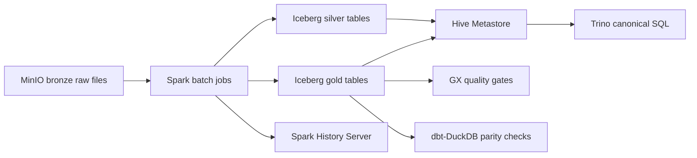

# ADR 03: Spark Batch Iceberg Plan

## Status

Planned.

## Date

2026-06-01

## Goal

Rewrite the current dbt-DuckDB Bronze/Silver/Gold transformation logic as runnable Spark batch jobs that read Bronze data from MinIO, write all current Silver/Gold outputs as Iceberg tables, register metadata through Hive Metastore, and validate results through PySpark checks, Great Expectations, Trino smoke queries, and dbt-DuckDB parity.

## Scope

In scope:

- Spark master/worker in Docker.
- Spark History Server for completed job evidence.
- Spark jobs for all current dbt-modeled Bronze/Silver/Gold entities.
- Airflow logical-window compatibility.
- Arbitrary date-range backfill parameters.
- Iceberg writes to MinIO through the Hive catalog.
- Validation and parity evidence.

Out of scope:

- Replacing the dbt-DuckDB compatibility path.
- Streaming jobs, which belong to ADR 04.
- Final Airflow DAG wiring, which belongs to ADR 06.

## Architecture Context

Spark becomes the canonical batch implementation. dbt-DuckDB remains a local regression oracle until Spark parity is proven.



Teaching note: Spark is the batch compute engine, Iceberg is the table format, MinIO is storage, Hive Metastore is the catalog, and Trino is the query interface. The plan should keep these roles distinct.

## Batch Ownership Rules

| Layer | Write owner | Read consumers | Notes |
| --- | --- | --- | --- |
| Bronze | Generator, Kafka Connect, landing jobs | Spark | Raw files are preserved and not normalized in place. |
| Silver | Spark | Spark, Trino, GX, DataHub | Cleaned and deduplicated Iceberg tables. |
| Gold | Spark | Trino, GX, DataHub, dbt parity scripts | Canonical business truth. |
| DuckDB local artifacts | dbt-DuckDB and Trino Gold export job | Local demo, executive snapshot, and parity evidence | Compatibility and portability paths, not canonical serving. |

## Required Table Coverage

Spark v1 should cover all current Gold outputs represented in the existing dbt implementation and diagrams:

| Category | Tables |
| --- | --- |
| Dimensions | `dim_customer`, `dim_seller`, `dim_product`, `dim_category`, `dim_date`, `dim_payment_method`, `dim_order_status`, `dim_shipment_status`, `dim_shipping_method`, `dim_promotion`, `bridge_product_category` |
| Facts | `fact_order`, `fact_order_item`, `fact_payment_attempt`, `fact_shipment`, `fact_inventory_snapshot`, `fact_promotion_application` |
| Serving/features | `obt_order_performance`, `agg_hourly_reconciled_kpi`, `feat_customer_90d`, `feat_stream_60m`, `feat_customer_unified` |

The future session may implement in internal batches, but acceptance requires all current Gold tables.

## Service And Profile Plan

| Service | Compose profile | UI/API | Health check |
| --- | --- | --- | --- |
| Spark master | `batch` | Suggested `localhost:8085` | Master UI and REST status reachable. |
| Spark worker | `batch` | Worker UI if exposed | Worker registered with master. |
| Spark History Server | `batch` | Suggested `localhost:18080` | Completed job visible after smoke run. |

Spark must use the lakehouse profile services from ADR 02: MinIO, Hive Metastore, and Trino.

## Job Interface

Use a stable command interface that Airflow can call later:

```powershell
uv run python scripts/spark/run_batch.py --start-ts 2026-05-01T00:00:00Z --end-ts 2026-05-01T01:00:00Z --mode hourly
uv run python scripts/spark/run_batch.py --start-ts 2026-05-01T00:00:00Z --end-ts 2026-05-03T00:00:00Z --mode backfill
```

`start-ts` and `end-ts` represent Airflow logical data windows. Backfills support arbitrary date ranges and must be idempotent.

Bronze event inputs follow the live Kafka Connect layout:

- `bronze/events/<topic>/ingest_date=<date>/*`

Spark reads Bronze object paths directly. It does not expect a Hive-style `topic=<topic>` partition prefix.

## Implementation Steps For Future Session

1. Add Spark services under the root `batch` compose profile.
2. Add Spark configuration for MinIO S3 access, Iceberg, and Hive catalog.
3. Create a Spark job package under a clear project folder such as `src/vina_bim_shop/spark/` or `jobs/spark/`.
4. Port dbt Bronze/Silver/Gold transformations one-for-one where practical.
5. Write Silver/Gold as Iceberg tables partitioned by logical event or metric date where useful.
6. Register tables through the Hive catalog.
7. Add PySpark validation checks for row counts, keys, and business formulas.
8. Add Trino smoke queries over Gold tables.
9. Add dbt-DuckDB parity checks for key row counts and KPIs.
10. Capture Spark UI/history evidence under `evidence/05_spark_batch/`.

## Validation Plan

| Validation | Purpose | Failure behavior |
| --- | --- | --- |
| PySpark assertions | Catch transformation-level defects close to code. | Fail job. |
| Great Expectations | Layer-level quality gate later orchestrated by Airflow. | Silver/Gold failures block DAGs. |
| Trino smoke SQL | Prove catalog and serving path. | Fail smoke test. |
| dbt-DuckDB parity | Prove Spark rewrite preserves current semantics. | Fail parity report until explicitly accepted. |

## Smoke Tests And Acceptance Checks

| Check | Required evidence |
| --- | --- |
| Spark services start | Spark master and worker visible. |
| Spark reads Bronze | Sample source count from MinIO Bronze. |
| Spark writes Iceberg | Silver/Gold tables visible through Hive catalog. |
| Trino reads Gold | `SELECT count(*)` and one KPI query succeed. |
| All current Gold tables exist | Inventory report lists all required Gold outputs. |
| Parity report | Key dbt and Spark KPI values compared with documented tolerance. |
| Spark History Server | Completed job visible with screenshot. |

## Do Not Do

- Do not remove dbt-DuckDB.
- Do not make Trino the normal writer for Silver/Gold.
- Do not implement Flink streaming in this session.
- Do not silently change business formulas from the existing dbt implementation.
- Do not use Airflow as a hard dependency for Spark local smoke tests.

## Assumptions

- Airflow will provide logical windows later, but Spark jobs must also run manually.
- Spark Gold is the official KPI truth once parity is proven.
- Full table coverage may be implemented incrementally inside the session, but the plan target is all current Gold tables.
