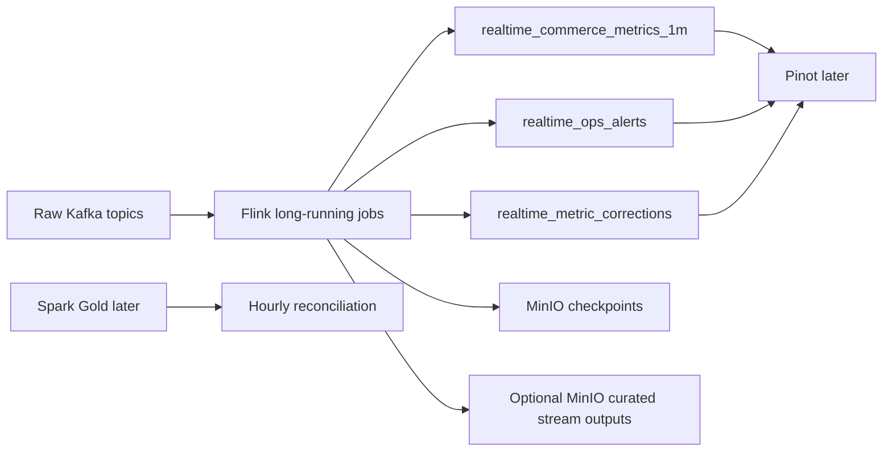

# ADR 04: Flink Streaming Plan

## Status

Planned.

## Date

2026-06-01

## Goal

Implement long-running Flink streaming jobs that consume raw Kafka source topics, compute event-time operational metrics, emit derived Kafka topics for Pinot, and write checkpoints plus selected curated streaming outputs to MinIO.

## Scope

In scope:

- Flink JobManager and TaskManager in Docker.
- Long-running jobs started with the streaming compose profile.
- Raw Kafka topic consumption.
- Topic-specific watermark and allowed-lateness policy.
- Derived Kafka outputs for Pinot ingestion.
- Full-snapshot correction records for late updates.
- MinIO checkpoints and optional curated streaming outputs.

Out of scope:

- Pinot table setup, which belongs to ADR 05.
- Airflow monitoring or supervision of Flink jobs.
- Replacing Spark batch reconciliation.

## Architecture Context

Flink is the speed layer. It should optimize for fresh operational visibility, while Spark remains the canonical reconciliation path.

Teaching note: Flink output is fast and provisional. It can emit correction records, but official historical KPIs still come from Spark Gold through Trino.

## Source And Derived Topics

| Input topic | Flink responsibility | Output topic |
| --- | --- | --- |
| `commerce_events` | Revenue, GMV proxy, checkout conversion, payment failures. | `realtime_commerce_metrics_1m` |
| `ops_events` | Traffic bursts, late-event counts, duplicate spikes. | `realtime_ops_alerts` |
| `catalog_events` | Optional inventory/category context if event payload contains enough fields. | `realtime_ops_alerts` or curated MinIO output |
| `fulfillment_events` | Optional fulfillment alert context. | `realtime_ops_alerts` |
| Any source topic | Late updates that change a closed or previously emitted window. | `realtime_metric_corrections` |

## Watermark And Lateness Policy

Use topic-specific lateness. Values are implementation defaults and must be externalized to config.

| Topic | Initial allowed lateness | Rationale |
| --- | ---: | --- |
| `commerce_events` | 5 minutes | User behavior and payment events may arrive out of order. |
| `catalog_events` | 10 minutes | Catalog and inventory source changes can lag batch exports. |
| `fulfillment_events` | 15 minutes | Logistics updates often arrive late. |
| `ops_events` | 2 minutes | Operational alerts should favor freshness. |

## Correction Contract

The approved correction strategy is append-only full snapshots.

Each correction record must include:

| Field | Meaning |
| --- | --- |
| `correction_id` | Unique correction event id. |
| `target_table` | Pinot table or logical stream being corrected. |
| `window_start_ts` / `window_end_ts` | Corrected event-time window. |
| `dimension_hash` | Stable hash of the dimension tuple. |
| `dimensions` | JSON object containing category/source/device/payment/status dimensions. |
| `metric_snapshot` | Full corrected metrics for that window and dimension tuple. |
| `correction_version` | Monotonic version per window and dimension tuple. |
| `correction_reason` | Late event, duplicate removal, schema evolution, or recomputation. |
| `created_ts` | Correction emit time. |

Pinot query examples in ADR 05 must explain how to select the latest full snapshot or reconcile base rows with correction rows.

## Service And Profile Plan

| Service | Compose profile | UI/API | Health check |
| --- | --- | --- | --- |
| Flink JobManager | `streaming` | Suggested `localhost:8086` | Flink overview API reachable. |
| Flink TaskManager | `streaming` | Internal | Registered with JobManager. |
| Stream job container or submit step | `streaming` | Logs plus Flink UI | Jobs visible as running. |

Flink depends on ADR 01 Kafka and ADR 02 MinIO for full operation.

## Implementation Steps For Future Session

1. Add Flink services under the root `streaming` compose profile.
2. Choose PyFlink only if Kafka and MinIO connector reliability is proven locally; otherwise document a fallback to a minimal JVM DataStream job.
3. Add stream job config for source topics, derived topics, window size, and per-topic lateness.
4. Implement 1-minute event-time windows for commerce metrics.
5. Implement ops alert streams for bursts, late arrivals, duplicate spikes, and payment issue signals.
6. Emit full-snapshot correction records when late data changes an emitted metric window.
7. Write checkpoints to the `checkpoints` bucket.
8. Optionally write curated stream output files to MinIO for audit and DataHub lineage.
9. Capture Flink UI and output-topic evidence under `evidence/06_flink_streaming/`.

## Smoke Tests And Acceptance Checks

| Check | Required evidence |
| --- | --- |
| Flink services start | JobManager UI screenshot and TaskManager registration. |
| Jobs are running | Flink UI job graph screenshot. |
| Raw topic consumption | Consumer lag or processed record count captured. |
| Derived topics populated | Kafka UI shows `realtime_commerce_metrics_1m`, `realtime_ops_alerts`, and correction topic samples. |
| Watermark behavior | Evidence row showing event time, processing time, and window assignment. |
| Correction behavior | One deterministic late event produces a full-snapshot correction record. |
| MinIO checkpoints | Checkpoint objects visible in MinIO. |

## Do Not Do

- Do not make Airflow responsible for monitoring Flink in v1.
- Do not write directly from Flink into Pinot in v1; use derived Kafka topics.
- Do not treat Flink metrics as official historical truth.
- Do not require product/customer SCD joins in the stream path unless the event payload already contains the needed fields.

## Assumptions

- Flink jobs are long-running local services.
- Derived topics were created by ADR 01 bootstrap.
- Pinot will handle provisional serving in ADR 05, including correction query examples.

