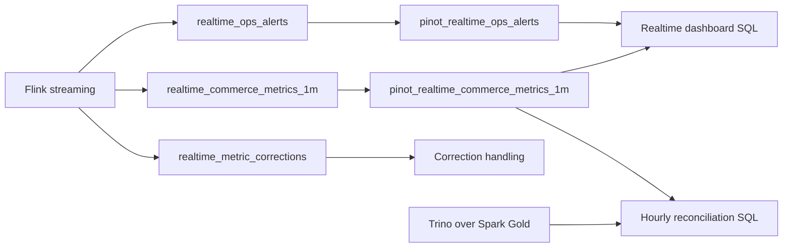

# ADR 05: Apache Pinot Serving Plan

## Status

Planned.

## Date

2026-06-01

## Goal

Implement Apache Pinot as the realtime OLAP serving layer for Flink-derived operational metrics and alerts. Pinot must consume derived Kafka topics, expose low-latency dashboard queries, and remain explicitly provisional compared with Spark Gold served through Trino.

## Scope

In scope:

- Pinot local services and UI.
- Declarative schema/table JSON files committed to the repo.
- Setup scripts that apply Pinot schemas/tables through the API.
- Realtime ingestion from Flink-derived Kafka topics.
- Query examples for live dashboards and reconciliation.
- Append-only correction handling for full-snapshot correction records.

Out of scope:

- Raw Kafka source-topic ingestion directly into Pinot.
- Official historical KPI serving.
- Replacing Trino or Spark Gold.

## Architecture Context



Teaching note: Pinot is optimized for live operational dashboards. It can be fresh and useful while still being provisional. Spark Gold through Trino wins for official historical reporting.

## Required Pinot Tables

| Pinot table | Source Kafka topic | Grain | Purpose |
| --- | --- | --- | --- |
| `pinot_realtime_commerce_metrics_1m` | `realtime_commerce_metrics_1m` | Event-time minute by dimension tuple | Revenue, GMV proxy, payment failures, checkout conversion. |
| `pinot_realtime_ops_alerts` | `realtime_ops_alerts` | Alert event | Traffic bursts, late arrivals, duplicate spikes, payment issue alerts. |

Correction records from `realtime_metric_corrections` may be modeled as:

- a separate Pinot table, or
- an append stream included in the commerce metrics table with a clear `record_kind`.

The future implementation must choose one shape and document the query contract in the evidence.

## Commerce Metrics Dimensions

Minimum dimension-rich grain for v1:

| Dimension | Purpose |
| --- | --- |
| `metric_minute` | Event-time minute window. |
| `primary_category` | Category-level operational monitoring. |
| `source` | Traffic/acquisition source. |
| `device_type` | Mobile/web behavior split. |
| `payment_method` | Payment issue monitoring. |
| `order_status` | Paid, failed, cancelled, placed status context. |
| `schema_version` | Schema evolution visibility. |

Minimum measures:

| Measure | Meaning |
| --- | --- |
| `order_count` | Count of order placed events or order-like events. |
| `checkout_started_count` | Checkout events in the window. |
| `payment_failure_count` | Failed payment events. |
| `revenue_amount` | Fresh revenue proxy from events. |
| `gmv_proxy_amount` | Fresh GMV proxy from events. |
| `late_event_count` | Late events included in or affecting the window. |
| `duplicate_event_count` | Duplicate events detected or reported. |
| `correction_version` | Version if the row is a correction snapshot. |

## Correction Query Contract

The approved Flink correction shape is append-only full snapshots. Pinot dashboard SQL must avoid double counting by using the latest version per window and dimension tuple when correction rows exist.

Example query pattern to document in the implementation:

```sql
-- Conceptual pattern. Exact Pinot SQL may differ after implementation.
SELECT
  metric_minute,
  primary_category,
  SUM(revenue_amount) AS latest_revenue
FROM pinot_realtime_commerce_metrics_1m
WHERE correction_version = (
  SELECT MAX(correction_version)
  FROM pinot_realtime_commerce_metrics_1m AS latest
  WHERE latest.metric_key = pinot_realtime_commerce_metrics_1m.metric_key
)
GROUP BY metric_minute, primary_category;
```

If Pinot SQL limitations make this pattern impractical, the implementation must create a separate correction table and provide a documented reconciliation query instead.

## Service And Profile Plan

| Service | Compose profile | UI/API | Health check |
| --- | --- | --- | --- |
| Pinot controller | `serving` | Pinot UI suggested on an available local port | Controller health endpoint. |
| Pinot broker | `serving` | Query endpoint | Broker health endpoint. |
| Pinot server | `serving` | Internal | Server registered with controller. |
| Pinot minion if needed | `serving` | Internal | Task endpoint if enabled. |

Pinot depends on Kafka from ADR 01 and Flink-derived topics from ADR 04.

## Implementation Steps For Future Session

1. Add Pinot services under the root `serving` compose profile.
2. Add declarative schema and table JSON files under an `infra/pinot/` style folder.
3. Add setup script that applies schemas/tables idempotently.
4. Configure Pinot realtime ingestion from Flink-derived Kafka topics.
5. Add days-level retention suitable for local coursework.
6. Add dashboard query examples for live revenue, GMV proxy, payment failures, conversion, and ops alerts.
7. Add reconciliation query examples comparing Pinot windows against `agg_hourly_reconciled_kpi` through Trino.
8. Label Pinot metrics as provisional in docs, config comments, and evidence.
9. Capture Pinot UI evidence under `evidence/07_pinot_serving/`.

## Smoke Tests And Acceptance Checks

| Check | Required evidence |
| --- | --- |
| Pinot services start | Controller/broker/server health JSON. |
| Tables created | UI or API shows both required tables. |
| Kafka ingestion works | Row count increases after derived-topic events are produced. |
| Dashboard SQL works | Sample query output captured. |
| Correction handling documented | Query or table strategy shown with sample correction record. |
| Reconciliation example exists | Pinot result compared to Trino/Spark Gold for an hourly window. |

## Do Not Do

- Do not ingest raw source topics directly into Pinot for v1.
- Do not use Pinot as the official historical KPI source.
- Do not hide correction semantics from dashboard query examples.
- Do not implement Airflow orchestration here except a future-compatible setup command.

## Assumptions

- Flink emits derived topics and full-snapshot correction records.
- Pinot retention should be measured in days for local demos.
- Exact Pinot image versions are pinned after smoke validation.

