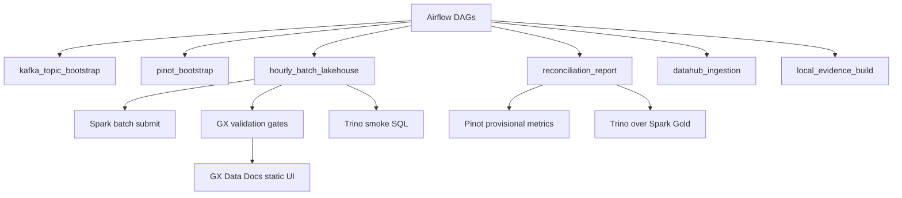

# ADR 06: Airflow And Great Expectations Orchestration Plan

## Status

Planned.

## Date

2026-06-01

## Goal

Implement Airflow as the local orchestration and control-plane layer, with Great Expectations as the validation framework. Airflow should manage batch jobs, bootstrap tasks, metadata ingestion, reconciliation, and evidence generation. It must not become the runtime monitor for long-running Flink jobs in v1.

## Scope

In scope:

- Airflow webserver, scheduler, init, and shared Postgres metadata database.
- Manual/demo DAGs with hourly logical windows.
- Great Expectations suites for raw MinIO, Spark outputs, Trino tables, and Pinot queries.
- GX Data Docs generated as local artifacts and served through a lightweight static UI container.
- DAGs for bootstrap, batch, reconciliation, DataHub ingestion, and evidence.

Out of scope:

- Airflow-managed Flink monitoring.
- Production secrets management.
- Cloud executors or Kubernetes.

## Architecture Context

Teaching note: Airflow is a coordinator, not a data processing engine. Spark and Flink do compute. GX validates data. Airflow decides ordering, retries, evidence capture, and failure behavior.

## Required DAGs

| DAG | Schedule | Responsibility |
| --- | --- | --- |
| `kafka_topic_bootstrap` | Manual | Create topics, register JSON Schemas, verify Kafka UI/API readiness. |
| `pinot_bootstrap` | Manual | Apply Pinot schemas/tables and run sample queries. |
| `hourly_batch_lakehouse` | Manual/demo with hourly logical windows | Land/check Bronze, run Spark, run GX, run Trino smoke queries. |
| `datahub_ingestion` | Manual | Run DataHub ingestion recipes after assets exist. |
| `reconciliation_report` | Manual/demo hourly logical windows | Compare Pinot provisional metrics against Spark Gold/Trino hourly KPI. |
| `local_evidence_build` | Manual | Collect screenshots, health JSON, row counts, query outputs, and report manifests. |

Use manual/demo schedules rather than real hourly production scheduling in v1. Each DAG should accept logical date/window parameters.

## GX Validation Gates

| Layer | Validation examples | Failure policy |
| --- | --- | --- |
| Bronze raw MinIO | File exists, schema-like envelope checks, freshness, malformed count. | Warn and quarantine; do not block all work. |
| Silver Iceberg | Required columns, type expectations, not-null keys, duplicate limits. | Fail DAG. |
| Gold Iceberg/Trino | KPI formulas, referential integrity, non-negative measures, row count ranges. | Fail DAG. |
| Pinot queries | Row presence, freshness, dashboard query sanity. | Warn unless reconciliation fails. |
| DataHub ingestion | Expected assets/tags/lineage exist. | Warn in governance DAG unless critical ingestion fails. |

GX Data Docs should be generated to local artifacts and served by a small static web container in the `orchestration` profile.

## Service And Profile Plan

| Service | Compose profile | UI/API | Health check |
| --- | --- | --- | --- |
| Airflow webserver | `orchestration` | Suggested `localhost:8082` | `/health` succeeds. |
| Airflow scheduler | `orchestration` | Internal | Scheduler job check succeeds. |
| Airflow init | `orchestration` | One-shot | Admin user and DB initialized. |
| GX static docs server | `orchestration` | Suggested `localhost:8088` | Static index page exists. |
| Shared Postgres | `lakehouse`/`orchestration` | Internal or mapped local port | Airflow DB reachable. |

## Implementation Steps For Future Session

1. Add Airflow services under the root `orchestration` compose profile.
2. Reuse shared Postgres with an isolated `airflow` database.
3. Add DAG folder structure and common connection helpers for Kafka, Spark, Trino, Pinot, MinIO, DataHub, and GX.
4. Implement the six required manual/demo DAGs.
5. Add GX project structure, expectation suites, checkpoints, and Data Docs output location.
6. Add a lightweight static UI container for GX Data Docs.
7. Wire Spark submission and Trino/Pinot smoke queries without making Airflow responsible for Flink monitoring.
8. Add evidence collection tasks that write under `evidence/08_airflow_gx/`.
9. Document how to trigger each DAG manually.

## Smoke Tests And Acceptance Checks

| Check | Required evidence |
| --- | --- |
| Airflow starts | UI screenshot and health JSON. |
| DAGs import | Airflow DAG list includes all six required DAGs. |
| Manual DAG run | At least one successful `kafka_topic_bootstrap` or batch dry run. |
| GX checkpoint | One suite runs and writes Data Docs artifacts. |
| GX Data Docs UI | Static page screenshot. |
| Failure behavior | Documentation shows Bronze warn vs Silver/Gold fail policy. |

## Do Not Do

- Do not make Airflow monitor or restart long-running Flink jobs in v1.
- Do not hide data quality failures by making every GX check warning-only.
- Do not require real hourly scheduling for local coursework.
- Do not introduce a separate Postgres service if shared Postgres is already available.

## Assumptions

- Spark jobs can run manually before Airflow DAGs are added.
- DataHub ingestion DAG may warn until ADR 07 is implemented.
- GX validation can mix filesystem/object checks, Trino SQL checks, and Pinot API/query checks.

