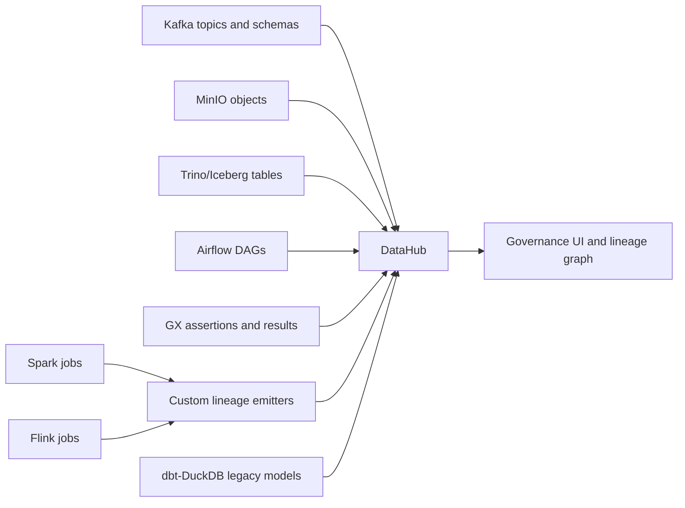

# ADR 07: DataHub Governance Plan

## Status

Planned.

## Date

2026-06-01

## Goal

Implement DataHub as the local data governance layer after real platform assets exist. DataHub must ingest metadata and lineage for Kafka, Schema Registry, MinIO, Trino/Iceberg, Airflow, GX, Spark, Flink, and dbt-DuckDB compatibility artifacts.

## Scope

In scope:

- DataHub frontend, GMS, actions/ingestion support, and required OpenSearch.
- Shared Kafka and shared Postgres with DataHub-specific isolation.
- Ingestion recipes for platform assets.
- Tags, glossary terms, ownership, and quality metadata.
- Automatic ingestion where available plus custom lineage for Spark/Flink where needed.

Out of scope:

- Running DataHub before real assets exist.
- Treating DataHub as the source of pipeline execution.
- Full production RBAC or auth hardening.

## Architecture Context

Teaching note: DataHub is not useful as an empty catalog. It belongs after the platform has assets, jobs, validations, and lineage to ingest.

## Infrastructure Boundary

Use shared infrastructure with isolation:

| Shared service | DataHub use | Isolation rule |
| --- | --- | --- |
| Kafka | DataHub metadata topics | Use DataHub-specific internal topics. Do not collide with business topics. |
| Postgres | DataHub metadata database | Use a separate `datahub` database/user. |
| OpenSearch | Required DataHub search backend | DataHub-owned service in `governance` profile. |
| Schema Registry | Business schemas plus possible DataHub integration | Do not replace JSON Schema topic contracts. |

Avoid a fully duplicated DataHub quickstart stack unless shared integration is proven impossible.

## Assets To Ingest

| Asset family | Minimum v1 metadata |
| --- | --- |
| Kafka topics | Source topics, derived topics, schemas, descriptions, provisional/canonical tags where relevant. |
| Schema Registry subjects | JSON Schema subject names and versions. |
| MinIO objects | Bronze prefixes and evidence/checkpoint locations as storage assets where practical. |
| Trino/Iceberg tables | Silver/Gold schemas, descriptions, tags, ownership, and lineage. |
| Airflow DAGs | Required DAGs, task relationships, run metadata where available. |
| GX assertions | Validation suites, checkpoints, and pass/fail metadata. |
| Spark jobs | Batch job identity and lineage from Bronze -> Silver -> Gold. |
| Flink jobs | Streaming job identity and lineage from raw topics -> derived topics -> Pinot. |
| dbt-DuckDB | Compatibility models and parity role, clearly labeled as regression oracle. |

## Governance Vocabulary

Minimum tags and glossary terms:

| Term/tag | Meaning |
| --- | --- |
| `bronze` | Raw source-fidelity data. |
| `silver` | Cleaned and standardized data. |
| `gold` | Business-ready canonical data. |
| `official` | Approved source for historical KPI reporting. |
| `provisional` | Fresh operational view subject to reconciliation. |
| `pii_safe` | Synthetic or non-sensitive local coursework data. |
| `regression_oracle` | dbt-DuckDB compatibility artifact used for parity checks. |
| `quality_gate` | Dataset or job has GX validation attached. |

## Service And Profile Plan

| Service | Compose profile | UI/API | Health check |
| --- | --- | --- | --- |
| DataHub GMS | `governance` | Internal/API | `/health` succeeds. |
| DataHub frontend | `governance` | Suggested `localhost:9002` | UI reachable. |
| DataHub actions/ingestion | `governance` | Internal | Worker logs healthy. |
| OpenSearch | `governance` | Internal | Cluster health yellow/green. |
| Shared Kafka/Postgres | `ingestion`/`lakehouse` | Internal | Existing health checks reused. |

## Implementation Steps For Future Session

1. Add DataHub services under the root `governance` compose profile.
2. Reuse shared Kafka and shared Postgres with isolated DataHub topics and database.
3. Add OpenSearch as DataHub-owned search backend.
4. Add ingestion recipes for Kafka, Schema Registry, Trino/Iceberg, Airflow, GX, and dbt artifacts.
5. Add MinIO ingestion or custom metadata emission for selected storage prefixes.
6. Emit custom lineage for Spark and Flink if automatic ingestion cannot capture the key paths.
7. Add ownership, tags, and glossary bootstrap script.
8. Add Airflow/manual CLI paths for running ingestion.
9. Capture evidence under `evidence/09_datahub_governance/`.

## Smoke Tests And Acceptance Checks

| Check | Required evidence |
| --- | --- |
| DataHub starts | UI screenshot and GMS health JSON. |
| Kafka assets visible | Source and derived topics searchable. |
| Trino/Iceberg tables visible | At least Gold tables searchable with schema. |
| Airflow DAGs visible | Required DAGs appear. |
| GX metadata visible | At least one validation suite/result linked or searchable. |
| Lineage graph visible | Bronze/Kafka -> Spark/Flink -> Gold/Pinot path shown. |
| Tags/glossary visible | `official`, `provisional`, and medallion tags applied. |

## Do Not Do

- Do not implement DataHub before meaningful assets exist.
- Do not duplicate Kafka/Postgres unless shared integration is proven unworkable.
- Do not let DataHub change the canonical truth policy.
- Do not overbuild governance workflows beyond local coursework evidence.

## Assumptions

- DataHub may require more memory than routine profiles; it is acceptable for `governance` and `all` to exceed the 4 GB comfort target.
- DataHub quality metadata may require custom emission from GX artifacts.
- Final lineage quality is more important than broad but shallow asset ingestion.

