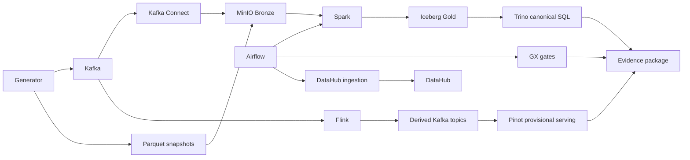

# ADR 08: Final Integration And Evidence Plan

## Status

Planned.

## Date

2026-06-01

## Goal

Integrate the eight implementation tracks into a staged and full-profile local platform demonstration. The final session must update the old contract-only narrative, refresh diagrams, verify UI access, run an end-to-end path, and produce coursework-grade evidence.

## Scope

In scope:

- Root compose profile verification.
- Staged startup documentation and best-effort full-stack startup.
- End-to-end pipeline verification.
- UI screenshots for all required services.
- Health JSON, row counts, SQL outputs, and evidence manifests.
- README and PlantUML diagram updates.

Out of scope:

- Adding new business features beyond the approved architecture.
- Production hardening.
- Replacing every local development path with full-stack execution.

## Architecture Context

Teaching note: The final demonstration should show the whole system without pretending the full stack is the only practical local workflow. Staged profiles are the normal path; `all` is a best-effort demo.

## Required UI Evidence

| UI | Evidence target |
| --- | --- |
| Kafka UI | Topics, message sample, derived topics present. |
| Schema Registry | JSON Schema subjects and versions. |
| Kafka Connect | Connector status for Bronze landing. |
| MinIO | Buckets and representative Bronze/Silver/Gold/checkpoint/evidence objects. |
| Trino | Query history and canonical KPI SQL result. |
| Spark UI | Running app or cluster state. |
| Spark History Server | Completed batch job. |
| Flink UI | Running streaming job and checkpoint state. |
| Pinot UI | Table status and sample realtime query. |
| Airflow UI | DAG list, graph view, and successful run. |
| GX Data Docs | Validation report page. |
| DataHub UI | Search result, tags/glossary, and lineage graph. |

## Final Verification Path

The final session should prove one complete path:

1. Start staged profiles in documented order.
2. Bootstrap Kafka topics and JSON Schemas.
3. Run generator in Kafka-plus-JSONL mode.
4. Land source snapshots and Kafka replay logs into MinIO Bronze.
5. Run Spark batch for one logical hourly window.
6. Write Silver/Gold Iceberg tables and validate through Trino.
7. Run Flink streaming and populate derived Kafka topics.
8. Ingest derived topics into Pinot and run dashboard SQL.
9. Run GX validations and publish Data Docs.
10. Run reconciliation report comparing Pinot provisional metrics to Spark Gold.
11. Run DataHub ingestion and verify metadata/lineage.
12. Generate evidence manifest and screenshots.

## Documentation Updates

Update existing docs in place where they currently say the distributed stack is only a contract.

| File family | Required update |
| --- | --- |
| `README.md` | Replace the old contract-only narrative with staged full-stack implementation guidance. |
| `architecture/masterplan.md` | Update phase status and point to the ADR roadmap. |
| `deliverables/02_schema_design.md` | Clarify dbt-DuckDB is now a compatibility oracle, not the only runnable implementation. |
| `architecture/diagrams/*.puml` | Update existing architecture/schema diagrams in place to reflect runnable services and evidence flow. |
| `evidence/` | Add final evidence manifest, screenshots, row counts, query outputs, and health JSON. |

## Compose Acceptance Strategy

| Startup mode | Command shape | Acceptance target |
| --- | --- | --- |
| Staged | `docker compose --profile ingestion up -d`, then additional profiles | Required and documented. |
| Full | `docker compose --profile all up --build -d` or equivalent final command | Best-effort/high-resource demonstration. |
| Reset | Project cleanup scripts | Must reset Kafka, MinIO, Pinot, and generated local evidence safely. |

Use standard Docker and project commands in docs so the project remains portable.

## Evidence Package

Minimum final evidence artifacts:

| Artifact | Purpose |
| --- | --- |
| `evidence/final_integration/service_health.json` | Machine-readable service health snapshot. |
| `evidence/final_integration/ui_screenshots/` | UI proof for each service. |
| `evidence/final_integration/row_counts.csv` | Bronze/Silver/Gold/Pinot row counts. |
| `evidence/final_integration/query_outputs/` | Trino and Pinot sample SQL outputs. |
| `evidence/final_integration/reconciliation_report.md` | Pinot vs Spark Gold comparison. |
| `evidence/final_integration/datahub_lineage.md` | Governance and lineage evidence summary. |
| `evidence/final_integration/final_manifest.json` | Commands, versions, timestamps, and artifact list. |

## Smoke Tests And Acceptance Checks

| Check | Required evidence |
| --- | --- |
| Staged profiles start | Health JSON for each profile. |
| Full profile attempted | Result recorded with resource notes if it cannot run under local budget. |
| End-to-end path runs | Evidence manifest links every major step. |
| Canonical SQL works | Trino query over Spark Gold returns KPI rows. |
| Realtime SQL works | Pinot query returns live/provisional rows. |
| Reconciliation works | Report explains any Pinot/Spark differences. |
| Governance works | DataHub lineage and tags visible. |
| Diagrams updated | Rendered PlantUML screenshots or generated images. |
| README updated | No remaining claim that Spark/Flink/Pinot/Trino are only contracts after implementation. |

## Do Not Do

- Do not make the full `all` profile the only accepted workflow.
- Do not erase the historical role of dbt-DuckDB; reframe it as compatibility/parity evidence.
- Do not imply Pinot is canonical for financial reporting.
- Do not add new architecture decisions silently in the final session.
- Do not document local-only helper tools as required project dependencies.

## Assumptions

- The final session may need to tune ports and memory after earlier sessions pin versions.
- Existing diagrams should be updated in place rather than duplicated into competing architecture diagrams.
- The final README should be user-facing and concise, with deep implementation detail linked to the ADR files.

